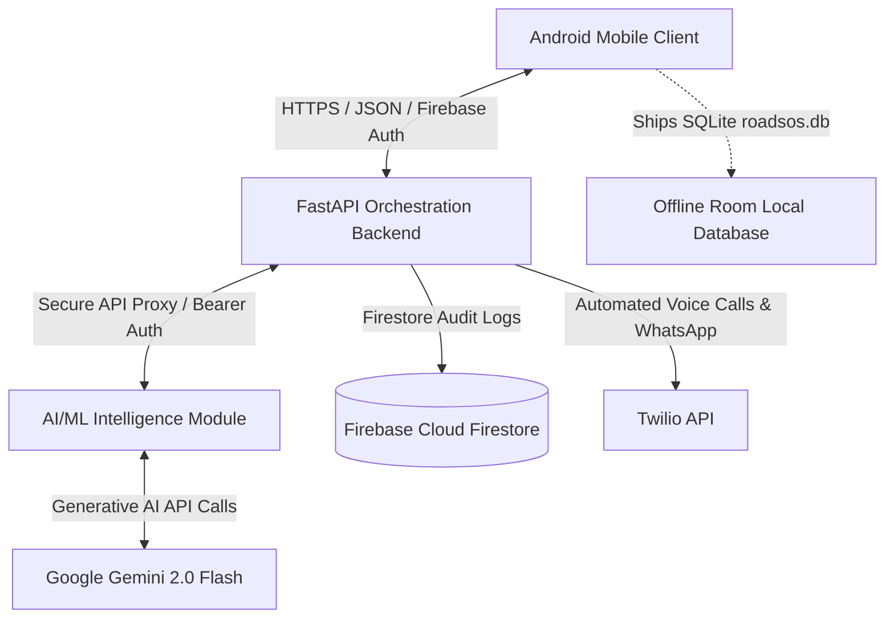

# RoadSOS — Unified Emergency Response System

RoadSOS is a production-grade, end-to-end emergency assistance platform designed to provide instant aid, sensor-based crash detection, and location-aware AI guidance during road accidents and vehicle breakdowns. The system is designed to maintain high reliability and user safety in low-connectivity or completely off-grid scenarios (specifically pre-seeded and optimized for Northeast India, including Assam).

This document serves as the **single source of truth** for all components, features, directories, setup instructions, environment variables, API specifications, and testing details.

---

## 📌 1. System Architecture & Interaction Flow

RoadSOS is structured into three main modules: the **Android Client**, the **FastAPI Orchestration Backend**, and the **AI/ML Intelligence Module**.



### Flow Breakdown:

1. **Accident Detection:** The Android app monitors device sensors in the background via [CrashDetectionService.kt](file:///d:/roadsos/android/app/src/main/java/com/example/roadsos/CrashDetectionService.kt). If a high-G collision is detected, a full-screen countdown activity is triggered.
2. **SOS Trigger:** If the user fails to respond to the countdown or manually clicks "Send SOS", the app sends a payload containing GPS coordinates, active contacts, and status to the backend.
3. **Authentication:** The backend verifies the user's identity using Firebase Authentication tokens.
4. **AI Context Enrichment:** The backend queries the AI/ML Module, which categorizes the emergency (e.g., accident, fire, theft, landslide) and provides first-aid/survival instructions.
5. **Alert Dispersal:** The backend triggers Twilio to place automated emergency calls and send rich WhatsApp messages (with a Google Maps location link) to the user's emergency contacts.
6. **Audit Trail:** The incident is stored in Firebase Cloud Firestore for audit purposes.
7. **Offline Fallback:** If internet is disconnected, the app uses its pre-seeded SQLite database (`roadsos.db`) containing district hospitals, national highway corridors, emergency numbers, and local keyword matching to provide safety templates entirely offline.

---

## 📂 2. Overall Directory Structure

```
roadsos/
├── README.md                           ← Master Documentation (This file)
│
├── android/                            ← Android Client Module
│   ├── app/
│   │   ├── build.gradle.kts           ← Gradle build dependencies
│   │   └── src/main/java/com/example/roadsos/
│   │       ├── CrashDetectionService.kt      ← Accelerometer & Gyroscope listener
│   │       ├── EmergencyAlertActivity.kt     ← Screen-on countdown alert activity
│   │       ├── MainActivity.kt               ← App entry and navigation drawer
│   │       ├── database/                     ← Local Room SQLite database
│   │       │   ├── AppDatabase.kt            ← Room DB config (version 3)
│   │       │   ├── dao/                      ← EmergencyContact & NearbyService DAOs
│   │       │   └── entity/                   ← Table models (Contacts, NearbyServices)
│   │       ├── network/                      ← Retrofit network interfaces
│   │       │   ├── ApiClient.kt              ← Base API Client (points to Backend)
│   │       │   └── ChatApiClient.kt          ← Chat Client instance
│   │       ├── repository/                   ← Repository data layers
│   │       ├── screens/                      ← Jetpack Compose screens
│   │       │   ├── ai/                       ← AIAssistantScreen chat screen
│   │       │   ├── home/                     ← HomeScreen & FullMapScreen (Google Maps)
│   │       │   └── auth/                     ← Auth screens (Email, Google Sign-In)
│   │       └── viewmodel/                    ← ViewModels (NearbyPlaces, Services)
│   └── settings.gradle.kts
│
├── backend/                            ← Orchestration Backend Module
│   ├── app/
│   │   ├── api/
│   │   │   ├── health.py             ← Health status check
│   │   │   └── sos.py                ← Main `/sos` POST handler
│   │   ├── core/
│   │   │   └── firebase_admin.py     ← Firebase SDK initialization
│   │   ├── dependencies/
│   │   │   └── auth_dependency.py    ← JWT validator checking Firebase Tokens
│   │   ├── schemas/
│   │   │   └── emergency_schema.py   ← Pydantic schema schemas
│   │   └── services/
│   │       ├── audit_service.py      ← Firebase Firestore logger
│   │       ├── chatbot_service.py    ← Client to proxy requests to AI Module
│   │       ├── notification_service.py ← Formats text messages and selects dispatches
│   │       └── twilio_service.py     ← Twilio client (Voice call & WhatsApp dispatch)
│   ├── Procfile
│   ├── railway.toml
│   └── requirements.txt
│
└── ai_module/                          ← AI/ML Intelligence Module
    ├── chatbot/
    │   ├── api.py                    ← FastAPI app exposing `/chat`
    │   ├── prompt_engine.py          ← System context prompt constructor
    │   ├── intent_classifier.py      ← Offline multi-lingual keyword classifier
    │   └── response_templates.py     ← Scripted templates for offline matching fallback
    ├── offline_database/
    │   ├── schema.sql                ← SQLite database schema
    │   ├── build_db.py               ← Compiler script converting CSVs into roadsos.db
    │   └── data/                     ← Raw datasets (Hospitals, Police, Corridors)
    ├── tests/                        ← PyTest test cases
    └── requirements.txt
```

---

## 📱 3. Android Client Module

The mobile client is built natively using **Kotlin** and **Jetpack Compose** for a modern, responsive, and reliable interface.

### Core Features

1. **Interactive Live Map:** Integrated with Google Maps SDK via [FullMapScreen.kt](file:///d:/roadsos/android/app/src/main/java/com/example/roadsos/screens/home/FullMapScreen.kt). Allows toggleable satellite layers and maps nearby services (Hospitals, Police, Garages, Food).
2. **Automatic Crash Detection:** Operates as a sticky foreground service ([CrashDetectionService.kt](file:///d:/roadsos/android/app/src/main/java/com/example/roadsos/CrashDetectionService.kt)). Uses sensor fusion:
   - **Accelerometer:** Detects high-G spikes (`shakeAcceleration > 28`).
   - **Gyroscope:** Detects rapid angular velocity rotation (`rotation > 22f`).
   - Simultaneously matching both conditions triggers the countdown alarm.
3. **Screen-on Alert Count:** [EmergencyAlertActivity.kt](file:///d:/roadsos/android/app/src/main/java/com/example/roadsos/EmergencyAlertActivity.kt) wakes the phone, overrides keyguards, plays a loop alarm, vibrates, and counts down for 15 seconds. If the user doesn't press "I'm Safe", it auto-dispatches an SOS payload.
4. **AI Assistant Interface:** Chat screen ([AIAssistantScreen.kt](file:///d:/roadsos/android/app/src/main/java/com/example/roadsos/screens/ai/AIAssistantScreen.kt)) allows users to talk with the Gemini-powered virtual assistant, providing first-aid guidance.
5. **Local Room Database:** Configured in [AppDatabase.kt](file:///d:/roadsos/android/app/src/main/java/com/example/roadsos/database/AppDatabase.kt), it caches nearby emergency resources for offline retrieval and stores user-configured emergency contacts (up to 5).

### Setup & Run

1. Open the [android](file:///d:/roadsos/android) directory in Android Studio.
2. Open `local.properties` in the root of the Android project and add your Google Maps API Key:
   ```properties
   MAPS_API_KEY=AIzaSyYourGoogleMapsApiKey
   ```
3. Place your Firebase configuration `google-services.json` inside the `android/app/` folder.
4. Generate the `roadsos.db` using the compiler script in the AI Module and copy it to `android/app/src/main/assets/roadsos.db`.
5. Open [ApiClient.kt](file:///d:/roadsos/android/app/src/main/java/com/example/roadsos/network/ApiClient.kt) and change `BASE_URL` to target your local machine's IP (e.g. `http://192.168.1.100:8080/`).
6. Build and run the project on a physical device or emulator.

---

## 🎛 4. FastAPI Orchestration Backend

The backend is an intermediate API gatekeeper responsible for security, notification dispatch routing, and proxying requests.

### Core Features

1. **Firebase Authentication Guard:** The dependency in [auth_dependency.py](file:///d:/roadsos/backend/app/dependencies/auth_dependency.py) extracts and verifies the bearer token from the incoming client request using the Firebase Admin SDK.
2. **SOS API Endpoints:** The [sos.py](file:///d:/roadsos/backend/app/api/sos.py) endpoint exposes `POST /sos`:
   - Validates contacts list (max 5).
   - Fetches AI classification and first-aid instructions from the AI Module.
   - Builds a location-specific alert string with a live Google Maps location link.
   - Logs the incident asynchronously to Firebase Cloud Firestore via [audit_service.py](file:///d:/roadsos/backend/app/services/audit_service.py).
   - Triggers Twilio notification alerts.
3. **Twilio Voice & WhatsApp Client:** Exposes automated alerting inside [twilio_service.py](file:///d:/roadsos/backend/app/services/twilio_service.py):
   - Sends customized WhatsApp alerts to contacts.
   - Makes automated voice calls (using TwiML XML speech conversion) to speak out details to emergency dispatchers.

### Environment Configuration

Create a `.env` file inside the [backend](file:///d:/roadsos/backend) folder:

```env
FIREBASE_SERVICE_ACCOUNT=firebase-service-account.json
AI_MODULE_URL=http://127.0.0.1:8000
AI_MODULE_API_KEY=your_secret_internal_key
TWILIO_ACCOUNT_SID=ACxxxxxxxxxxxxxxxxxxxxxxxx
TWILIO_AUTH_TOKEN=your_auth_token
TWILIO_WHATSAPP_NUMBER=+14155238886
TWILIO_CALL_NUMBER=+1xxxxxxxxxx
ENVIRONMENT=development
DEBUG=true
```

### Setup & Run

1. Install Python 3.11+ and navigate to the backend directory:
   ```bash
   cd backend
   ```
2. Create and activate a Python virtual environment:
   ```bash
   python -m venv venv
   # Windows:
   .\venv\Scripts\activate
   # macOS/Linux:
   source venv/bin/activate
   ```
3. Install dependencies:
   ```bash
   pip install -r requirements.txt
   ```
4. Place your `firebase-service-account.json` file inside the root of the backend folder.
5. Start the server using Uvicorn:
   ```bash
   uvicorn app.main:app --reload --port 8080
   ```
   The backend API is now running at `http://127.0.0.1:8080/`. You can view documentation at `http://127.0.0.1:8080/docs`.

---

## 🤖 5. AI/ML Intelligence Module

The AI module acts as the intelligence hub, processing natural language, mapping highway segments, and packing the offline resource assets.

### Core Features

1. **FastAPI Prompt Interface:** Exposes the main `/chat` post route inside [api.py](file:///d:/roadsos/ai_module/chatbot/api.py). It accepts user messages and location contexts, constructs structured prompts via [prompt_engine.py](file:///d:/roadsos/ai_module/chatbot/prompt_engine.py), calls Google Gemini 2.0 Flash, and returns structured safety suggestions.
2. **Offline Multi-Lingual Classifier:** Located in [intent_classifier.py](file:///d:/roadsos/ai_module/chatbot/intent_classifier.py). Standardizes inputs against keyword lists defined in English, Hindi, and Assamese. Supports emergency categories like `accident`, `tyre_burst`, `breakdown`, `medical`, `fire`, `lost`, `theft`, `robbery`, `assault`, `suspicious_activity`, `flood`, and `landslide`.
3. **Seeding Pipeline Compiler:** The script [build_db.py](file:///d:/roadsos/ai_module/offline_database/build_db.py) parses CSV files in the data directory containing coordinate locations for regional hospitals, police stations, fuel bunks, national highway corridors, and emergency helplines. It compiles them into a single SQLite database (`roadsos.db`) based on the unified database schema [schema.sql](file:///d:/roadsos/ai_module/offline_database/schema.sql).

### Environment Configuration

Create a `.env` file inside the [ai_module](file:///d:/roadsos/ai_module) folder:

```env
GEMINI_API_KEY=AIzaSyYourGeminiApiKey
DB_PATH=offline_database/roadsos.db
MAX_HISTORY_TURNS=6
LLM_TIMEOUT_SECONDS=4
AI_MODULE_API_KEY=your_secret_internal_key
ALLOWED_ORIGINS=*
```

### API Endpoint Contracts

- **`POST /chat`** (Secure endpoint - requires `Authorization: Bearer <AI_MODULE_API_KEY>`):
  - **Request Body:**
    ```json
    {
      "session_id": "optional-uuid",
      "user_message": "I met with a car accident, someone is bleeding",
      "context": {
        "lat": 26.1445,
        "lng": 91.7362,
        "state": "Assam",
        "district": "Kamrup",
        "nearest_highway": "NH37",
        "is_sos_active": true
      },
      "history": []
    }
    ```
  - **Response Body:**
    ```json
    {
      "session_id": "uuid",
      "reply": "LLM generated instructions: Stay calm, check breathing, apply pressure...",
      "intent_detected": "accident",
      "detected_type": "accident",
      "priority": "high",
      "suggested_actions": [
        { "label": "Call Police", "number": "100" },
        { "label": "Call Ambulance", "number": "108" }
      ],
      "source": "llm"
    }
    ```
- **`GET /health`**: Returns `{"status": "ok", "gemini_enabled": true}`.

### Setup & Run

1. Navigate to the `ai_module` folder:
   ```bash
   cd ai_module
   ```
2. Create and activate a Python virtual environment:
   ```bash
   python -m venv venv
   # Windows:
   .\venv\Scripts\activate
   # macOS/Linux:
   source venv/bin/activate
   ```
3. Install dependencies:
   ```bash
   pip install -r requirements.txt
   ```
4. Build the offline database asset:
   ```bash
   python offline_database/build_db.py
   ```
   This reads data CSVs and creates `offline_database/roadsos.db`.
5. Launch the service:
   ```bash
   python chatbot/api.py
   ```
   The AI Module service will launch at `http://127.0.0.1:8000/`.

---

## 🧪 6. Verification & Testing

To run the automated test suite verifying both intent keyword weights and REST API responses:

1. Navigate to the `ai_module` directory.
2. Run tests with PyTest:
   ```bash
   pytest tests/ -v
   ```
   _(Note: Certain tests targeting network delays and structural mock fallbacks are designed to document architectural constraints)._

---

## 👥 7. Contributors & Core Responsibilities

- **Swapnil** — AI / ML(Prompt Engineering, LLM integration, Multi-lingual Keyword classification, SQLite database compilation)
- **Backend Developers: Alakesh** — Firebase JWT Auth Guards, Twilio SMS/WhatsApp dispatcher, text-to-speech IVR voice pipelines, Firestore audits.
- **Android Developers :Kunal & Tarpan** — Foreground sensor fusion loops, screen-on alert activity overlays, Google Maps styling, Room persistence layers.
